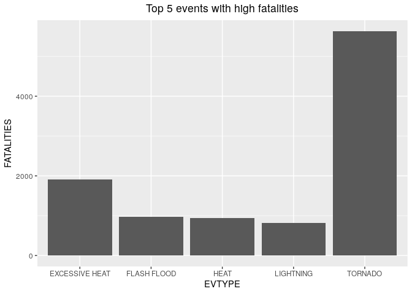
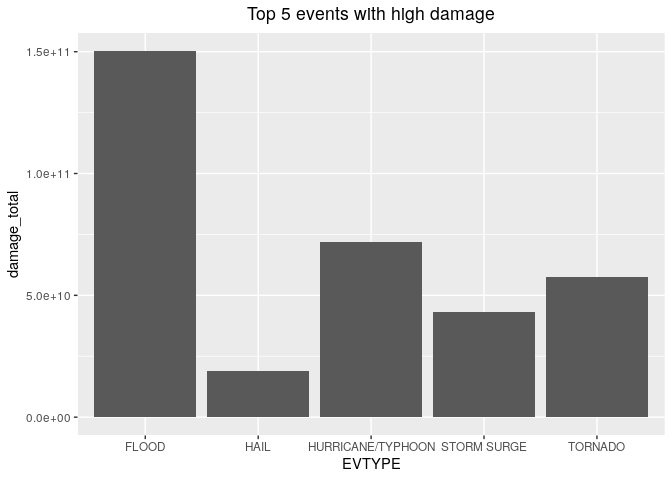

# Synopsis 
Storms and other severe weather events can cause both public health and economic problems for communities and municipalities. Many severe events can result in fatalities, injuries, and property damage, and preventing such outcomes to the extent possible is a key concern. This project involves exploring the U.S. National Oceanic and Atmospheric Administration's (NOAA) storm database. This database tracks characteristics of major storms and weather events in the United States, including when and where they occur, as well as estimates of any fatalities, injuries, and property damage. Here analysis was conducted to reveal the answers for the following questions:

1. Across the United States, which types of events are most harmful with respect to population health?
2. Across the United States, which types of events have the greatest economic consequences?

The analysis results shows when considering fatalities and injuries tornado was highy harmful followed by high heat and flood. The greatest damage to economy was done by the Flood followed by hurrican/typhoon and tornado.
 
# Data Processing
The data processing codes are shown below. We begin with downloading the data. Then the data required for further analysis was copied in the variable *storm_data_final*. Some transformations needed were conversion of date and property damage. 

```r
# Library needed
library(dplyr)
# File URL
fileURL <- "https://d396qusza40orc.cloudfront.net/repdata%2Fdata%2FStormData.csv.bz2"   
if (!file.exists("storm_data.csv.bz2" )) {
   download.file(fileURL ,"storm_data.csv.bz2",method="auto")
}
# Load data
storm_data <- read.csv("storm_data.csv.bz2" , stringsAsFactors = FALSE)
# Select data
storm_data_final <- select(storm_data, BGN_DATE, STATE, EVTYPE, FATALITIES, 
                                   INJURIES,PROPDMG,PROPDMGEXP, CROPDMG, CROPDMGEXP)
# Convert date
storm_data_final$BGN_DATE <- as.POSIXct(strptime(storm_data_final$BGN_DATE,"%m/%d/%Y %H:%M:%S"))
# Convert damage to value for property and crop
storm_data_final <- storm_data_final %>%
mutate(damage_property = ifelse(grepl("K", PROPDMGEXP), PROPDMG*1000,
                           ifelse(grepl("M", PROPDMGEXP),PROPDMG*1000000,
                           ifelse(grepl("B", PROPDMGEXP),PROPDMG*1000000000,
                           ifelse(grepl("", PROPDMGEXP),PROPDMG)))),
         damage_crop = ifelse(grepl("K", CROPDMGEXP,), CROPDMG*1000,
                       ifelse(grepl("M", CROPDMGEXP),CROPDMG*1000000,
                       ifelse(grepl("B", CROPDMGEXP),CROPDMG*1000000000,
                       ifelse(grepl("", PROPDMGEXP),CROPDMG)))),
         damage_total = damage_property + damage_crop 
  )
```

# Result
The following lines of code finds our research question and plots the results. The figures shows the top 5 events with highest fatalities, injuries and economic damage.


```r
library(ggplot2)
harmful_event <- aggregate(INJURIES ~ EVTYPE, storm_data_final, sum)
harmful_event <- harmful_event[order(-harmful_event$INJURIES),]
ggplot(harmful_event[1:5,],aes(x=EVTYPE,y=INJURIES))+geom_bar(stat="identity")+labs(xlab="Event Type",ylab="Injuries",title="Top 5 events with high injuries")+theme(plot.title = element_text(hjust = 0.5))
```

<!-- -->

```r
harmful_event_fat <- aggregate(FATALITIES ~ EVTYPE, storm_data_final, sum)
harmful_event_fat <- harmful_event_fat[order(-harmful_event_fat$FATALITIES),]
ggplot(harmful_event_fat[1:5,],aes(x=EVTYPE,y=FATALITIES))+geom_bar(stat="identity")+labs(xlab="Event Type",ylab="Injuries",title="Top 5 events with high fatalities")+theme(plot.title = element_text(hjust = 0.5))
```

<!-- -->

```r
economic_loss_event <- aggregate(damage_total~EVTYPE, storm_data_final, sum)
economic_loss_event <-economic_loss_event[order(-economic_loss_event$damage_total),]
ggplot(economic_loss_event[1:5,],aes(x=EVTYPE,y=damage_total))+geom_bar(stat="identity")+labs(xlab="Event Type",ylab="Total Damage",title="Top 5 events with high damage")+theme(plot.title = element_text(hjust = 0.5))
```

<!-- -->

The analysis results shows when considering fatalities and injuries tornado was highy harmful followed by high heat and flood. The greatest damage to economy was done by the Flood followed by hurrican/typhoon and tornado.
